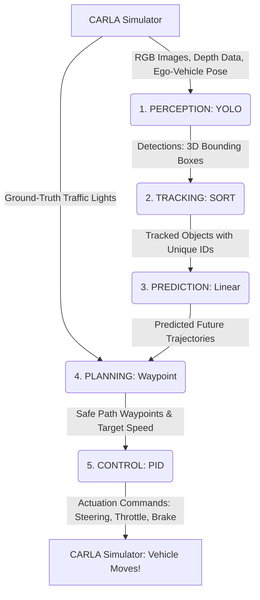

# Pylot Autonomous Driving Stack: Data Flow and Module Explanation

## 1. Does your YOLO perception model detect traffic lights?
No, your custom YOLO model only detects vehicles and pedestrians. The reason your car successfully stopped at red lights is because of a specific setting in your `20_perception_detection.conf` file:
`--simulator_traffic_light_detection`

Because training a robust traffic light model is complex (requiring detecting the light state - red/yellow/green - from a distance), Pylot is currently configured to bypass the visual perception for traffic lights and directly query the CARLA simulator's "ground-truth" data. Pylot knows exactly where the traffic lights are and what color they are directly from the simulation engine.

## 2. What does each module do? (The Autonomous Pipeline)

* **Perception (YOLOv8):** Looks at raw camera images and draws 2D bounding boxes around obstacles (cars, people). It uses depth sensors to project these 2D boxes into 3D space.
* **Tracking (SORT):** YOLO only looks at one frame at a time; it doesn't know if the car in frame 1 is the same car in frame 2. The Tracking module solves this by using algorithms (like Kalman Filters) to assign a unique ID to each obstacle and track it continuously across time.
* **Prediction (Linear):** Once an object is tracked over several frames, the Prediction module calculates its speed and heading. It then extrapolates a "predicted trajectory" (e.g., "this person is walking at 1 m/s across the road, so in 3 seconds they will be exactly here").
* **Planning (Waypoint):** The "brain" of the operation. It receives the HD Map (where the lanes are), the target destination, the traffic light states, and the predicted future locations of all obstacles. It computes a safe, collision-free path of waypoints for the car to follow, and determines the "speed factor" (e.g., slowing down for a yellow light, or setting speed to 0 if an obstacle is blocking the path).
* **Control (PID):** The "muscles" of the operation. It takes the planned path (target waypoints and speed) and calculates exactly how much to turn the steering wheel, press the gas pedal (throttle), or hit the brakes to smoothly follow that path.

## 3. Data Flow Diagram

